# Diagram catalogue

All diagrams are target designs, not as-built evidence. Mermaid and DOT are editable; PNG and SVG are rendered from DOT.

**Metadata:** Numbered source files carry diagram IDs, version `0.1`, and target state in source comments. The 14 initial diagrams have local PNG/SVG assets. Supplemental Mermaid files render directly when opened on GitHub; separate PNG/SVG assets were not generated because Graphviz is unavailable. The three C4-level views use C4-style Mermaid flowcharts rather than native C4 syntax because GitHub's renderer does not bundle Mermaid's experimental C4 extension; see [Mermaid C4 syntax](https://mermaid.js.org/syntax/c4) and [GitHub discussion on C4 renderer support](https://github.com/orgs/community/discussions/197898).

## Ecomdy logical architecture

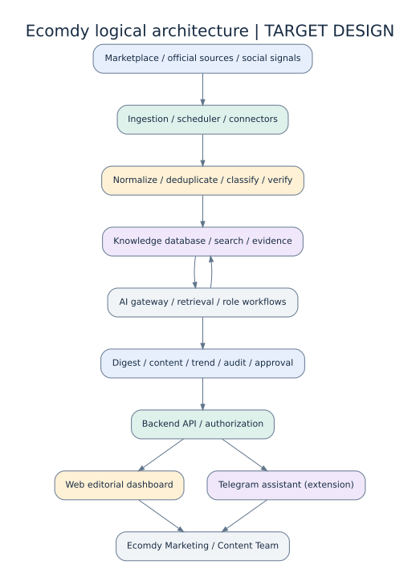

[PNG](01-system-architecture.png) · [SVG](01-system-architecture.svg) · [Mermaid](01-system-architecture.mmd) · [DOT](01-system-architecture.dot)

Mermaid source rendered by GitHub

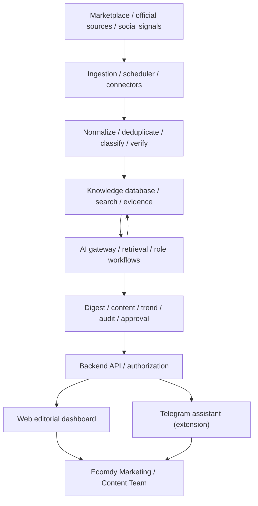
```mermaid
flowchart TD
  s["Marketplace / official sources / social signals"]
  i["Ingestion / scheduler / connectors"]
  p["Normalize / deduplicate / classify / verify"]
  db["Knowledge database / search / evidence"]
  ai["AI gateway / retrieval / role workflows"]
  svc["Digest / content / trend / audit / approval"]
  api["Backend API / authorization"]
  web["Web editorial dashboard"]
  tg["Telegram assistant (extension)"]
  u["Ecomdy Marketing / Content Team"]
  s --> i
  i --> p
  p --> db
  db --> ai
  ai --> db
  ai --> svc
  svc --> api
  api --> web
  api --> tg
  web --> u
  tg --> u
```

## Data ingestion

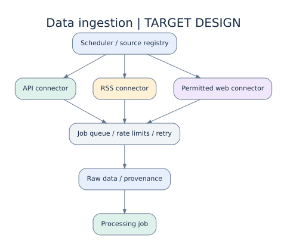

[PNG](02-ingestion.png) · [SVG](02-ingestion.svg) · [Mermaid](02-ingestion.mmd) · [DOT](02-ingestion.dot)

Mermaid source rendered by GitHub

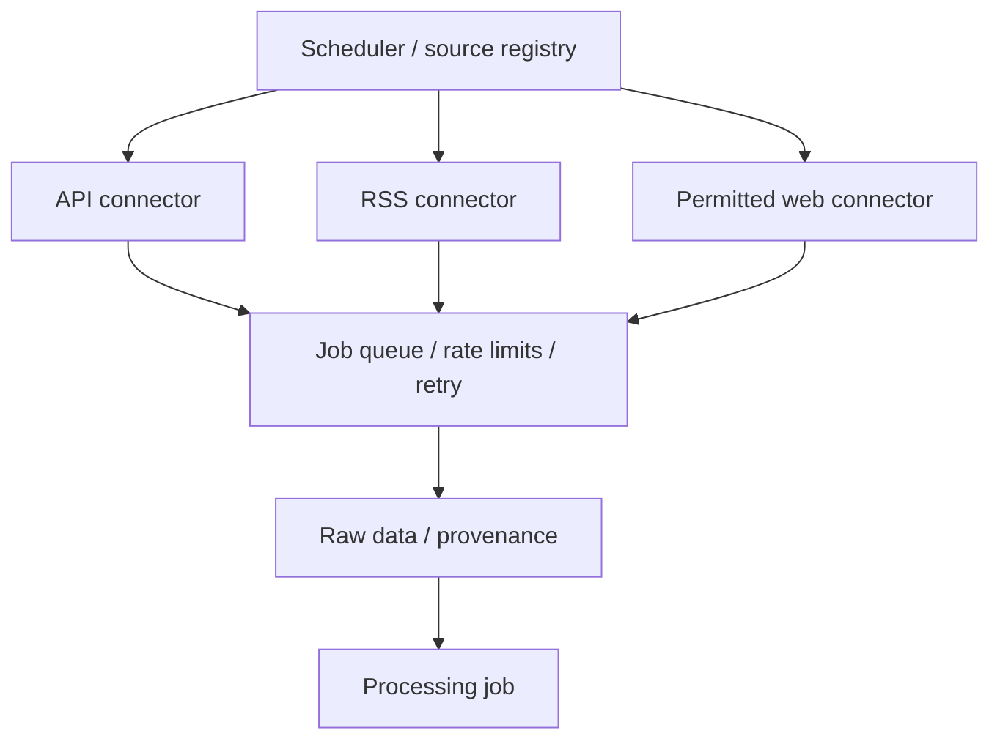
```mermaid
flowchart TD
  s["Scheduler / source registry"]
  a["API connector"]
  r["RSS connector"]
  w["Permitted web connector"]
  q["Job queue / rate limits / retry"]
  raw["Raw data / provenance"]
  p["Processing job"]
  s --> a
  s --> r
  s --> w
  a --> q
  r --> q
  w --> q
  q --> raw
  raw --> p
```

## Data processing pipeline

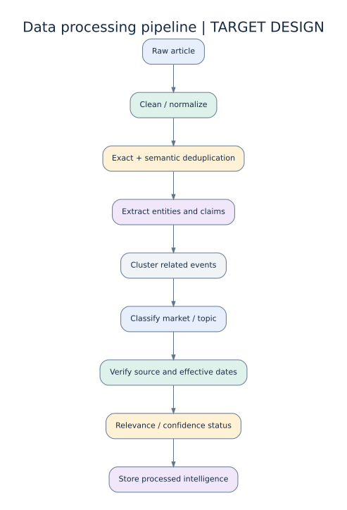

[PNG](03-processing.png) · [SVG](03-processing.svg) · [Mermaid](03-processing.mmd) · [DOT](03-processing.dot)

Mermaid source rendered by GitHub

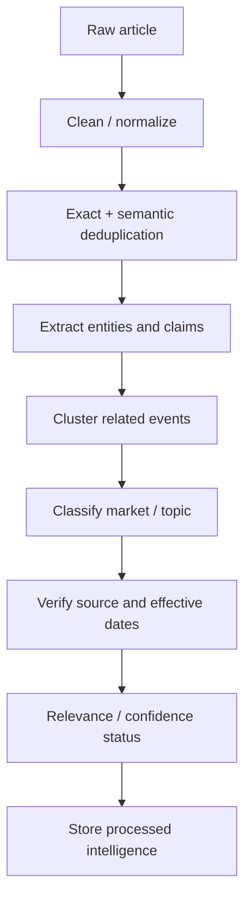
```mermaid
flowchart TD
  n0["Raw article"]
  n1["Clean / normalize"]
  n2["Exact + semantic deduplication"]
  n3["Extract entities and claims"]
  n4["Cluster related events"]
  n5["Classify market / topic"]
  n6["Verify source and effective dates"]
  n7["Relevance / confidence status"]
  n8["Store processed intelligence"]
  n0 --> n1
  n1 --> n2
  n2 --> n3
  n3 --> n4
  n4 --> n5
  n5 --> n6
  n6 --> n7
  n7 --> n8
```

## Conceptual data relationships

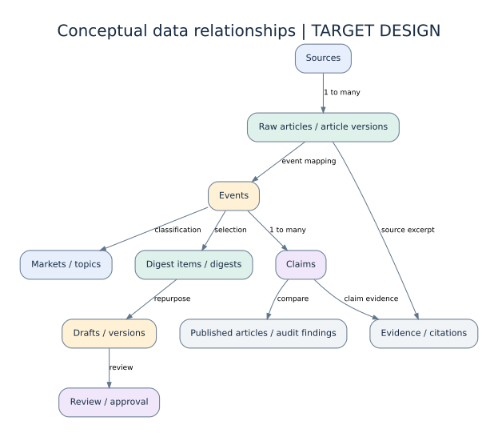

[PNG](04-conceptual-data.png) · [SVG](04-conceptual-data.svg) · [Mermaid](04-conceptual-data.mmd) · [DOT](04-conceptual-data.dot)

Mermaid source rendered by GitHub

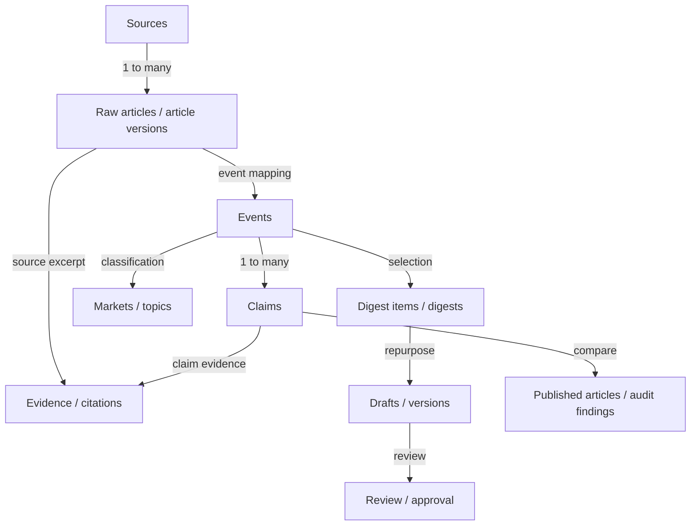
```mermaid
flowchart TD
  s["Sources"]
  a["Raw articles / article versions"]
  ev["Events"]
  c["Claims"]
  e["Evidence / citations"]
  m["Markets / topics"]
  d["Digest items / digests"]
  draft["Drafts / versions"]
  r["Review / approval"]
  audit["Published articles / audit findings"]
  s -->|1 to many| a
  a -->|event mapping| ev
  ev -->|1 to many| c
  a -->|source excerpt| e
  c -->|claim evidence| e
  ev -->|classification| m
  ev -->|selection| d
  d -->|repurpose| draft
  draft -->|review| r
  c -->|compare| audit
```

## AI orchestration and model routing

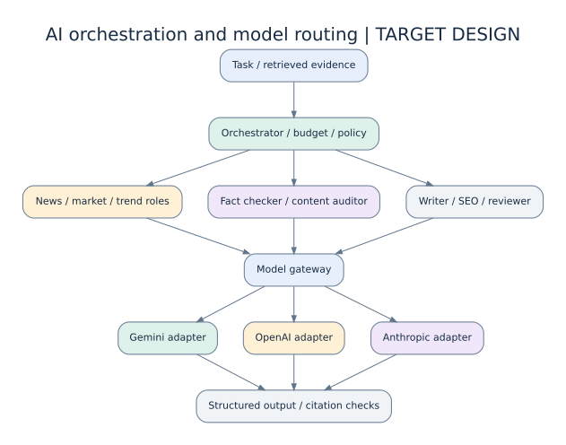

[PNG](05-ai-orchestration.png) · [SVG](05-ai-orchestration.svg) · [Mermaid](05-ai-orchestration.mmd) · [DOT](05-ai-orchestration.dot)

Mermaid source rendered by GitHub

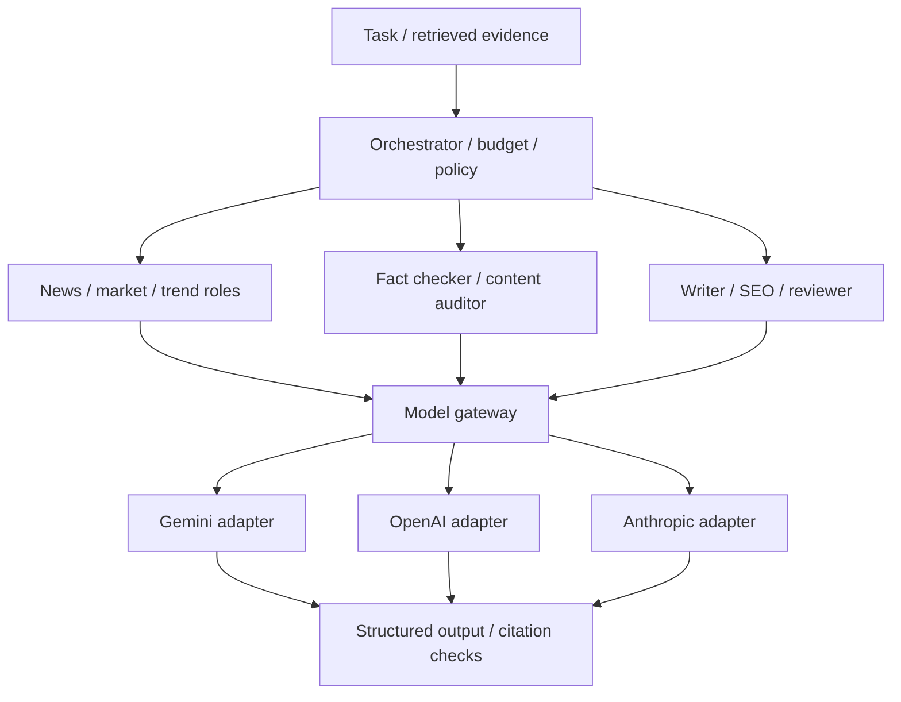
```mermaid
flowchart TD
  request["Task / retrieved evidence"]
  router["Orchestrator / budget / policy"]
  n["News / market / trend roles"]
  f["Fact checker / content auditor"]
  w["Writer / SEO / reviewer"]
  g["Model gateway"]
  a["Gemini adapter"]
  b["OpenAI adapter"]
  c["Anthropic adapter"]
  v["Structured output / citation checks"]
  request --> router
  router --> n
  router --> f
  router --> w
  n --> g
  f --> g
  w --> g
  g --> a
  g --> b
  g --> c
  a --> v
  b --> v
  c --> v
```

## Workflow A — automatic intelligence collection

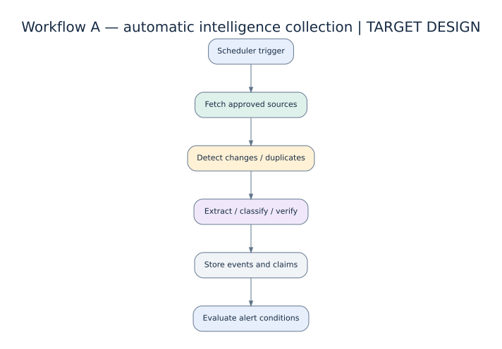

[PNG](06-automatic-collection.png) · [SVG](06-automatic-collection.svg) · [Mermaid](06-automatic-collection.mmd) · [DOT](06-automatic-collection.dot)

Mermaid source rendered by GitHub

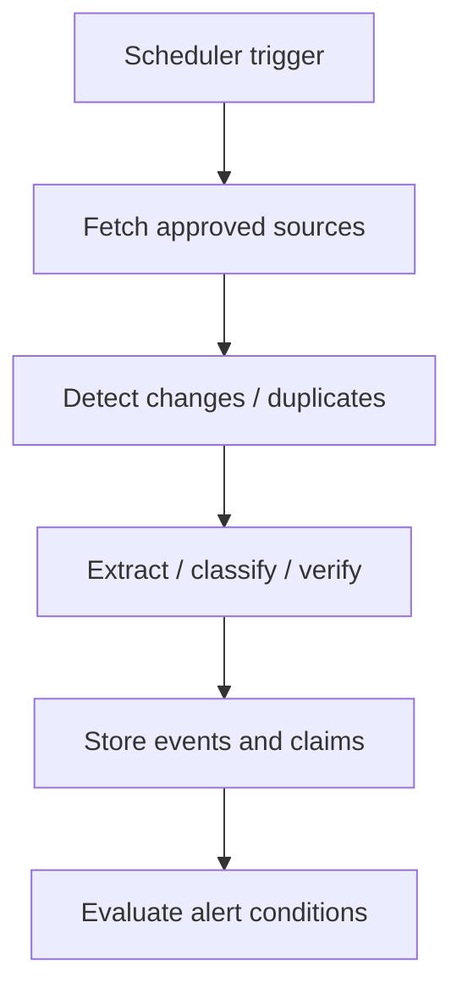
```mermaid
flowchart TD
  n0["Scheduler trigger"]
  n1["Fetch approved sources"]
  n2["Detect changes / duplicates"]
  n3["Extract / classify / verify"]
  n4["Store events and claims"]
  n5["Evaluate alert conditions"]
  n0 --> n1
  n1 --> n2
  n2 --> n3
  n3 --> n4
  n4 --> n5
```

## Workflow B — on-demand assistant

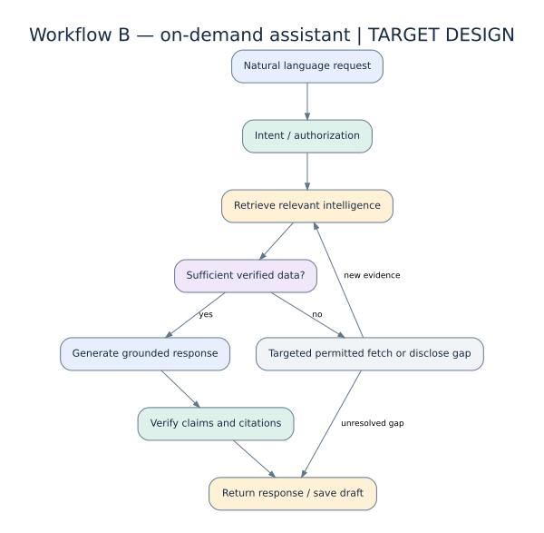

[PNG](07-assistant.png) · [SVG](07-assistant.svg) · [Mermaid](07-assistant.mmd) · [DOT](07-assistant.dot)

Mermaid source rendered by GitHub

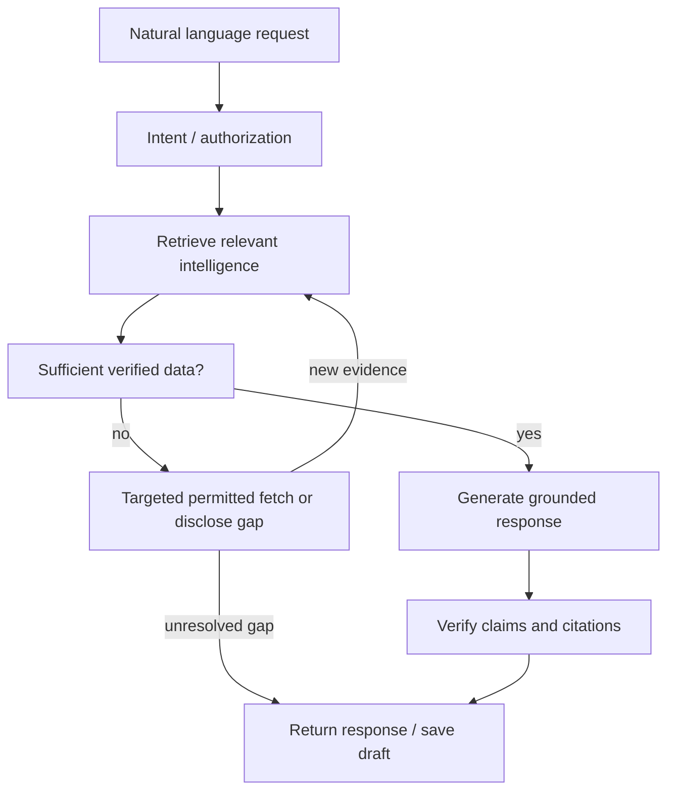
```mermaid
flowchart TD
  u["Natural language request"]
  i["Intent / authorization"]
  r["Retrieve relevant intelligence"]
  q["Sufficient verified data?"]
  f["Targeted permitted fetch or disclose gap"]
  a["Generate grounded response"]
  v["Verify claims and citations"]
  out["Return response / save draft"]
  u --> i
  i --> r
  r --> q
  q -->|no| f
  f -->|new evidence| r
  f -->|unresolved gap| out
  q -->|yes| a
  a --> v
  v --> out
```

## Workflow C — content production and approval

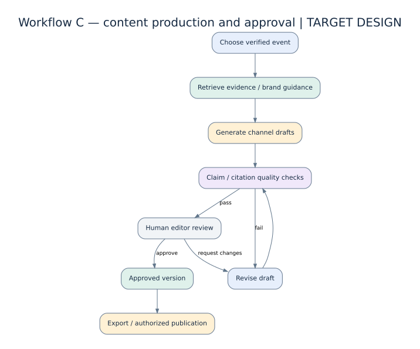

[PNG](08-content-approval.png) · [SVG](08-content-approval.svg) · [Mermaid](08-content-approval.mmd) · [DOT](08-content-approval.dot)

Mermaid source rendered by GitHub

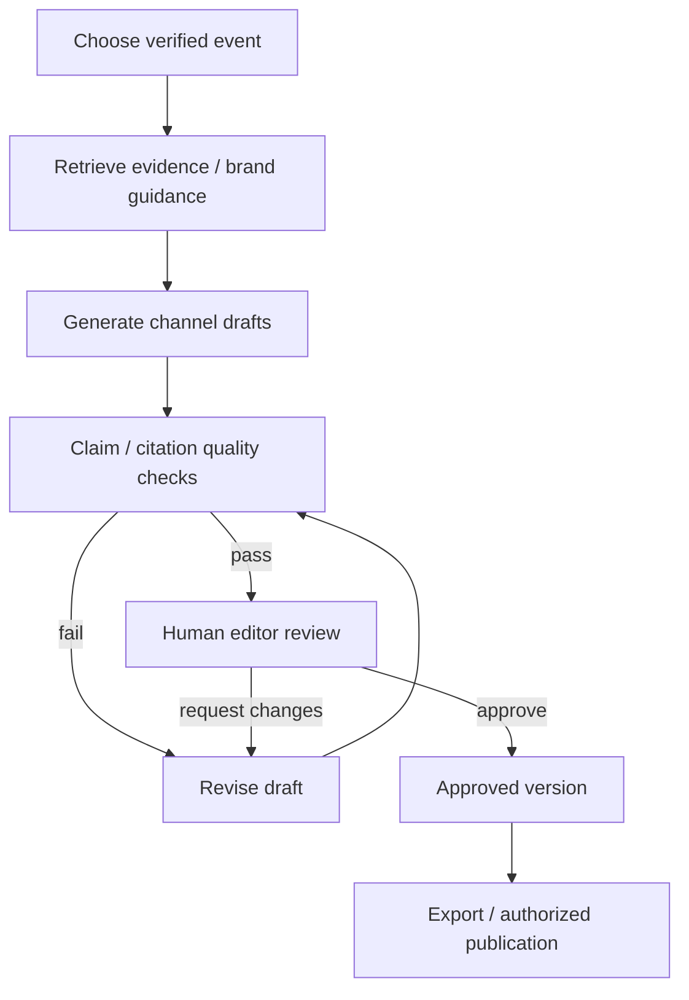
```mermaid
flowchart TD
  s["Choose verified event"]
  r["Retrieve evidence / brand guidance"]
  g["Generate channel drafts"]
  v["Claim / citation quality checks"]
  h["Human editor review"]
  e["Revise draft"]
  a["Approved version"]
  x["Export / authorized publication"]
  s --> r
  r --> g
  g --> v
  v -->|fail| e
  e --> v
  v -->|pass| h
  h -->|request changes| e
  h -->|approve| a
  a --> x
```

## Trend detection (extension)

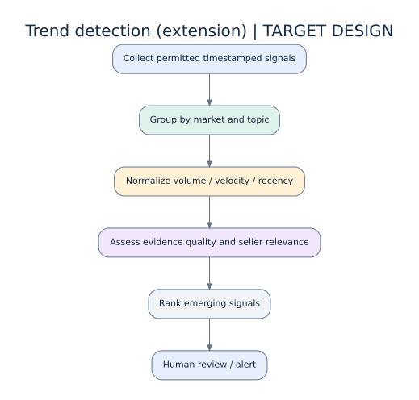

[PNG](09-trend-intelligence.png) · [SVG](09-trend-intelligence.svg) · [Mermaid](09-trend-intelligence.mmd) · [DOT](09-trend-intelligence.dot)

Mermaid source rendered by GitHub

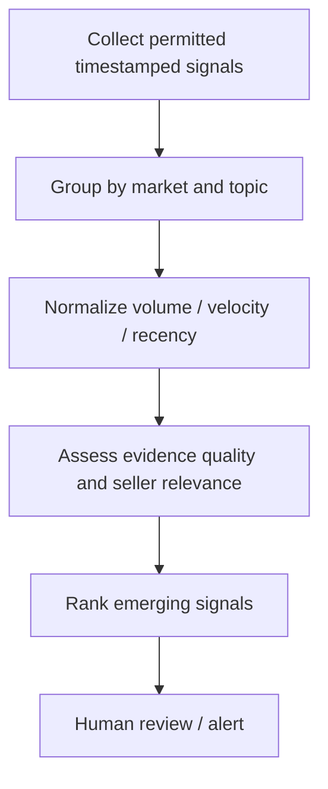
```mermaid
flowchart TD
  n0["Collect permitted timestamped signals"]
  n1["Group by market and topic"]
  n2["Normalize volume / velocity / recency"]
  n3["Assess evidence quality and seller relevance"]
  n4["Rank emerging signals"]
  n5["Human review / alert"]
  n0 --> n1
  n1 --> n2
  n2 --> n3
  n3 --> n4
  n4 --> n5
```

## Physical deployment — modular monolith

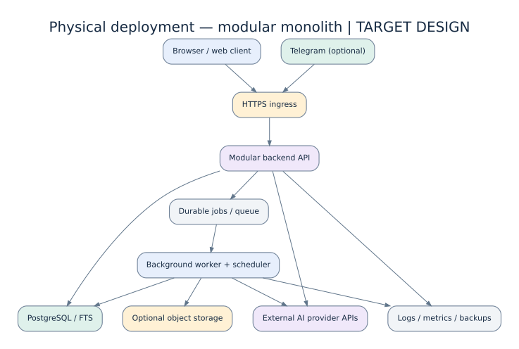

[PNG](10-deployment.png) · [SVG](10-deployment.svg) · [Mermaid](10-deployment.mmd) · [DOT](10-deployment.dot)

Mermaid source rendered by GitHub

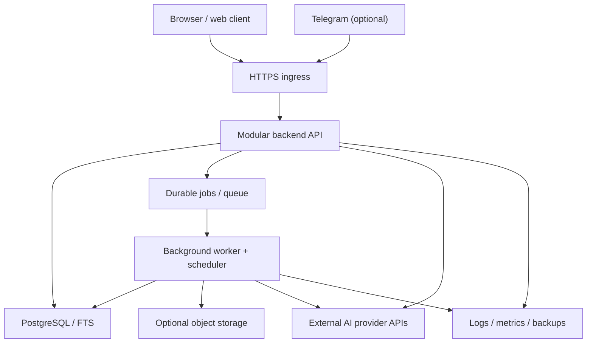
```mermaid
flowchart TD
  web["Browser / web client"]
  tg["Telegram (optional)"]
  proxy["HTTPS ingress"]
  api["Modular backend API"]
  q["Durable jobs / queue"]
  worker["Background worker + scheduler"]
  pg["PostgreSQL / FTS"]
  obj["Optional object storage"]
  ai["External AI provider APIs"]
  mon["Logs / metrics / backups"]
  web --> proxy
  tg --> proxy
  proxy --> api
  api --> pg
  api --> q
  q --> worker
  worker --> pg
  worker --> obj
  worker --> ai
  api --> ai
  api --> mon
  worker --> mon
```

## Development vs product boundary

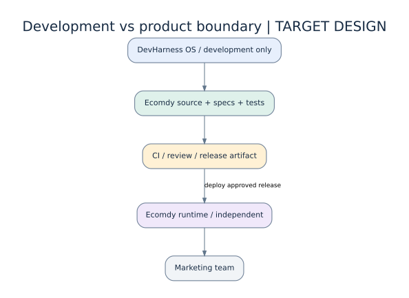

[PNG](11-harness-boundary.png) · [SVG](11-harness-boundary.svg) · [Mermaid](11-harness-boundary.mmd) · [DOT](11-harness-boundary.dot)

Mermaid source rendered by GitHub

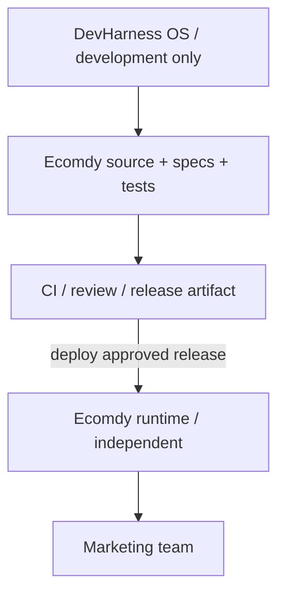
```mermaid
flowchart TD
  dev["DevHarness OS / development only"]
  repo["Ecomdy source + specs + tests"]
  ci["CI / review / release artifact"]
  run["Ecomdy runtime / independent"]
  owner["Marketing team"]
  dev --> repo
  repo --> ci
  ci -->|deploy approved release| run
  run --> owner
```

## Content freshness audit

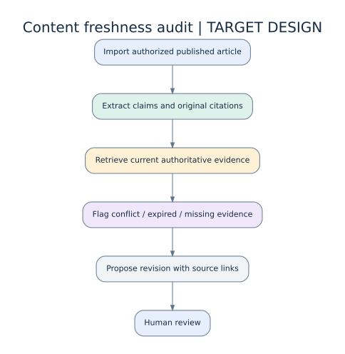

[PNG](12-content-audit.png) · [SVG](12-content-audit.svg) · [Mermaid](12-content-audit.mmd) · [DOT](12-content-audit.dot)

Mermaid source rendered by GitHub

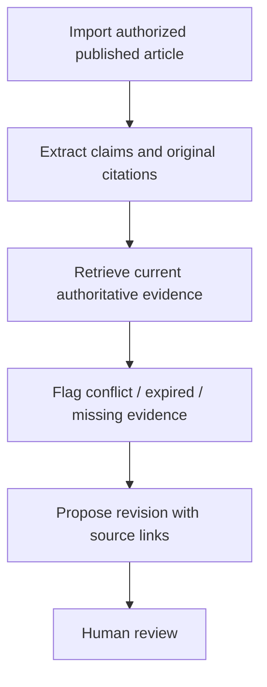
```mermaid
flowchart TD
  n0["Import authorized published article"]
  n1["Extract claims and original citations"]
  n2["Retrieve current authoritative evidence"]
  n3["Flag conflict / expired / missing evidence"]
  n4["Propose revision with source links"]
  n5["Human review"]
  n0 --> n1
  n1 --> n2
  n2 --> n3
  n3 --> n4
  n4 --> n5
```

## Ecomdy delivery roadmap

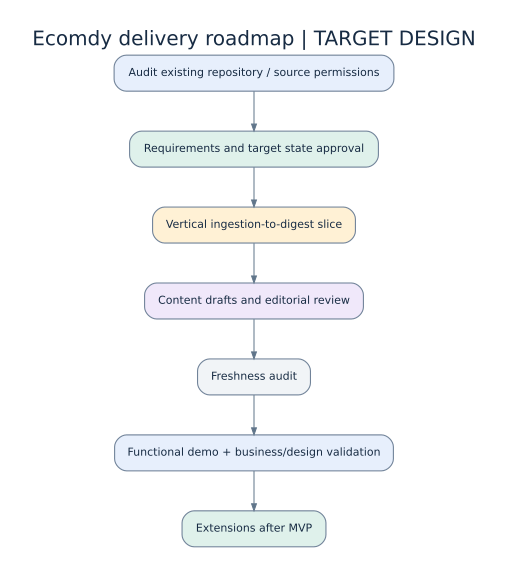

[PNG](13-roadmap.png) · [SVG](13-roadmap.svg) · [Mermaid](13-roadmap.mmd) · [DOT](13-roadmap.dot)

Mermaid source rendered by GitHub

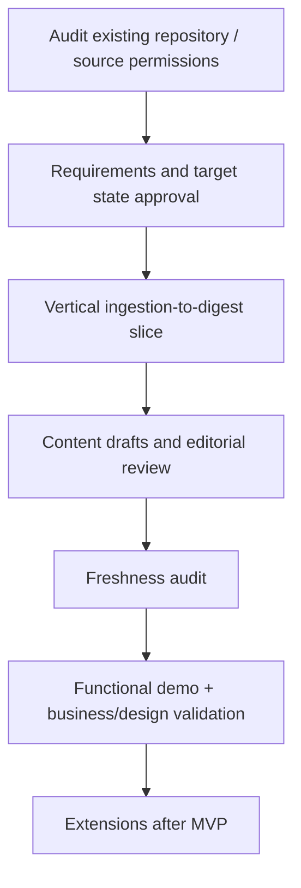
```mermaid
flowchart TD
  n0["Audit existing repository / source permissions"]
  n1["Requirements and target state approval"]
  n2["Vertical ingestion-to-digest slice"]
  n3["Content drafts and editorial review"]
  n4["Freshness audit"]
  n5["Functional demo + business/design validation"]
  n6["Extensions after MVP"]
  n0 --> n1
  n1 --> n2
  n2 --> n3
  n3 --> n4
  n4 --> n5
  n5 --> n6
```

## Editorial workspace user flow

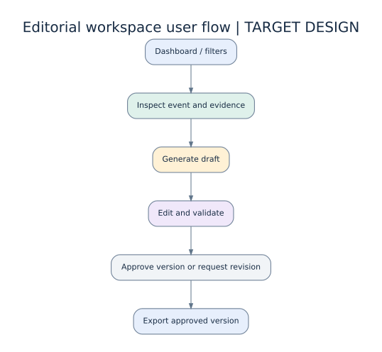

[PNG](14-editorial-ui.png) · [SVG](14-editorial-ui.svg) · [Mermaid](14-editorial-ui.mmd) · [DOT](14-editorial-ui.dot)

Mermaid source rendered by GitHub

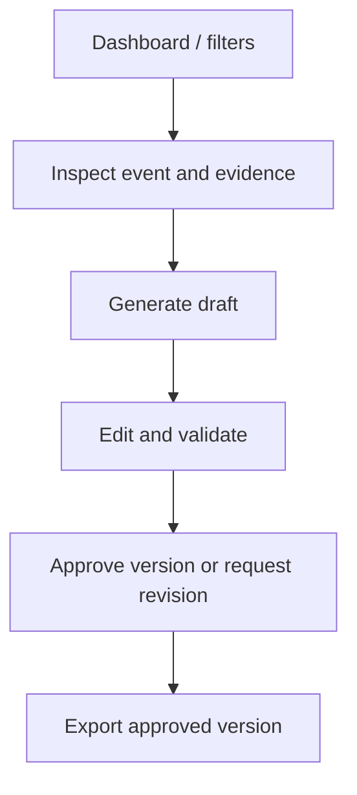
```mermaid
flowchart TD
  n0["Dashboard / filters"]
  n1["Inspect event and evidence"]
  n2["Generate draft"]
  n3["Edit and validate"]
  n4["Approve version or request revision"]
  n5["Export approved version"]
  n0 --> n1
  n1 --> n2
  n2 --> n3
  n3 --> n4
  n4 --> n5
```

## Additional architecture and workflow diagrams

These Mermaid sources cover C4-style context/container/component views and dedicated workflows missing from the initial 14-image gallery. Each file contains ID, version, and target-state metadata and is rendered by GitHub when opened.

| ID | Diagram | Editable / rendered Mermaid source |
|---|---|---|
| ECOMDY-D15 | C4-style System Context view | [15-c4-system-context.mmd](15-c4-system-context.mmd) |
| ECOMDY-D16 | C4-style Container view | [16-c4-containers.mmd](16-c4-containers.mmd) |
| ECOMDY-D17 | C4-style Backend Component view | [17-c4-components.mmd](17-c4-components.mmd) |
| ECOMDY-D18 | Module Dependency Graph | [18-module-dependencies.mmd](18-module-dependencies.mmd) |
| ECOMDY-D19 | Conceptual Entity Relationship Diagram | [19-entity-relationship.mmd](19-entity-relationship.mmd) |
| ECOMDY-D20 | Claim Source Verification | [20-source-verification.mmd](20-source-verification.mmd) |
| ECOMDY-D21 | Claim and Evidence Relationships | [21-claim-evidence.mmd](21-claim-evidence.mmd) |
| ECOMDY-D22 | Market Relevance Analysis | [22-market-relevance.mmd](22-market-relevance.mmd) |
| ECOMDY-D23 | Evidence Retrieval and Generation | [23-rag-evidence-retrieval.mmd](23-rag-evidence-retrieval.mmd) |
| ECOMDY-D24 | Weekly Digest Workflow | [24-weekly-digest.mmd](24-weekly-digest.mmd) |
| ECOMDY-D25 | Telegram Assistant Workflow · proposed extension | [25-telegram-assistant.mmd](25-telegram-assistant.mmd) |
| ECOMDY-D26 | Authentication and Authorization | [26-authentication-authorization.mmd](26-authentication-authorization.mmd) |
| ECOMDY-D27 | Scheduler and Worker Architecture | [27-scheduler-worker.mmd](27-scheduler-worker.mmd) |
| ECOMDY-D28 | Error Recovery Workflow | [28-error-recovery.mmd](28-error-recovery.mmd) |
| ECOMDY-D29 | Security and Trust Boundaries | [29-security-boundaries.mmd](29-security-boundaries.mmd) |
| ECOMDY-D30 | Observability Architecture | [30-observability.mmd](30-observability.mmd) |
| ECOMDY-D31 | MVP Architecture · proposal pending owner approval | [31-mvp-architecture.mmd](31-mvp-architecture.mmd) |
| ECOMDY-D32 | Product Task Dependency DAG | [32-product-task-dependencies.mmd](32-product-task-dependencies.mmd) |
